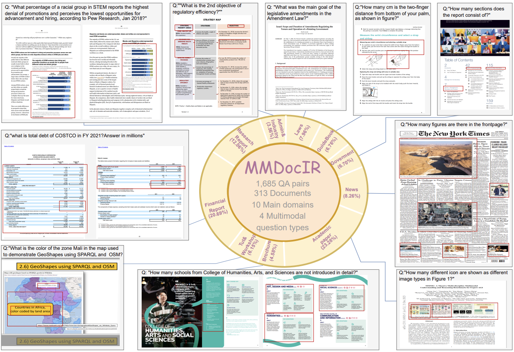

# MMDocIR: Benchmarking Multi-Modal Retrieval for Long Documents





## 1. Abstract
Multi-modal document retrieval is designed to identify and retrieve various forms of multi-modal content, such as figures, tables, charts, and layout information from extensive documents.
Despite its significance, there is a notable lack of a robust benchmark to effectively evaluate the performance of systems in multi-modal document retrieval.
To address this gap, this work introduces a new benchmark, named as **MMDocIR**, encompassing two distinct tasks: **page-level** and **layout-level** retrieval. 
**The former focuses on localizing the most relevant pages within a long document, while the latter targets the detection of specific layouts, offering a more fine-grained granularity than whole-page analysis.**
A layout can refer to a variety of elements such as textual paragraphs, equations, figures, tables, or charts. 
The MMDocIR benchmark comprises a rich dataset featuring expertly annotated labels for 1,685 questions and bootstrapped labels for 173,843 questions, making it a pivotal resource for advancing multi-modal document retrieval for both training and evaluation. 
Through rigorous experiments, we reveal that 
(i) visual retrievers significantly outperform their text counterparts; 
(ii) MMDocIR train set can effectively benefit the training process of multi-modal document retrieval;
(iii) text retrievers leveraging on VLM-text perform much better than those using OCR-text. 
These findings underscores the potential advantages of integrating visual elements for multi-modal document retrieval.


## 2. Task Setting
### Page-level Retrieval
The page-level retrieval task is designed to identify the most relevant pages within a document in response to a user query.

### Layout-level Retrieval
The layout-level retrieval aims to retrieve most relevant layouts. 
The layouts are defined as the fine-grained elements such as paragraphs, equations, figures, tables, and charts. 
This task allows for a more nuanced content retrieval, honing in on specific information that directly answers user queries.


## 3. Evaluation Set
### 3.1 Document Analysis

**MMDocIR** evaluation set includes 313 long documents averaging 65.1 pages, categorized into ten main domains: research reports, administration&industry, tutorials&workshops, academic papers, brochures, financial reports, guidebooks, government documents, laws, and news articles. 
Different domains feature distinct distributions of multi-modal information. For instance, research reports, tutorials, workshops, and brochures predominantly contain images, whereas financial and industry documents are table-rich. In contrast, government and legal documents primarily comprise text. Overall, the modality distribution is: Text (60.4%), Image (18.8%), Table (16.7%), and other modalities (4.1%).

### 3.2 Question and Annotation Analysis
**MMDocIR** evluation set encompasses 1,658 questions, 2,107 page labels, and 2,638 layout labels. The modalities required to answer these questions distribute across four categories: Text (44.7%), Image (21.7%), Table (37.4%), and Layout/Meta (11.5%). The ``Layout/Meta'' category encompasses questions related to layout information and meta-data statistics. 
Notably, the dataset poses several challenges: 254 questions necessitate cross-modal understanding, 313 questions demand evidence across multiple pages, and 637 questions require reasoning based on multiple layouts. These complexities highlight the need for advanced multi-modal reasoning and contextual understanding.


## 4. Train Set


## Citation
If you use any datasets from this organization in your research, please cite the original dataset as follows:
```
@misc{dong2025mmdocirbenchmarkingmultimodalretrieval,
      title={MMDocIR: Benchmarking Multi-Modal Retrieval for Long Documents}, 
      author={Kuicai Dong and Yujing Chang and Xin Deik Goh and Dexun Li and Ruiming Tang and Yong Liu},
      year={2025},
      eprint={2501.08828},
      archivePrefix={arXiv},
      primaryClass={cs.IR},
      url={https://arxiv.org/abs/2501.08828}, 
}
```